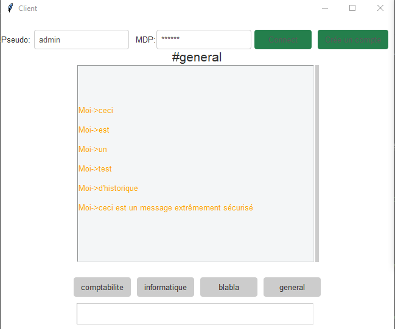
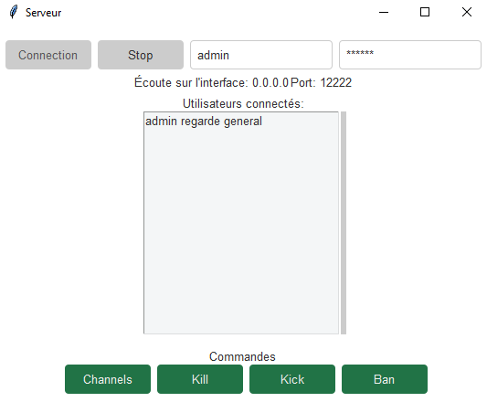
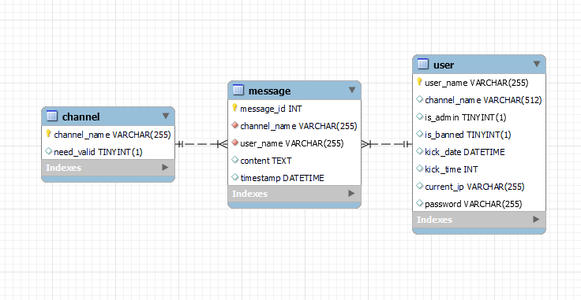

# SAE 301

Application de chat en temps réel basée sur les sockets avec Python

## Screenshots
Client

Serveur

Schéma relationnel

## Documentation

[Installation](https://linktodocumentation)
[Serveur](https://linktodocumentation)
[Client](https://linktodocumentation)
[Compte-rendu](https://linktodocumentation)
